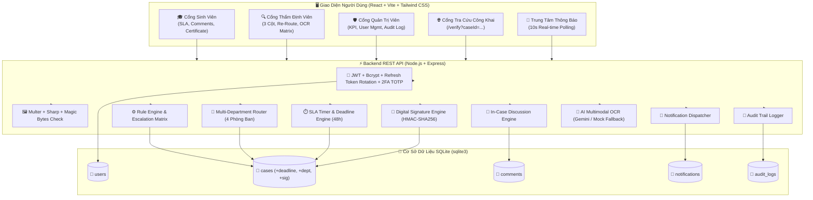
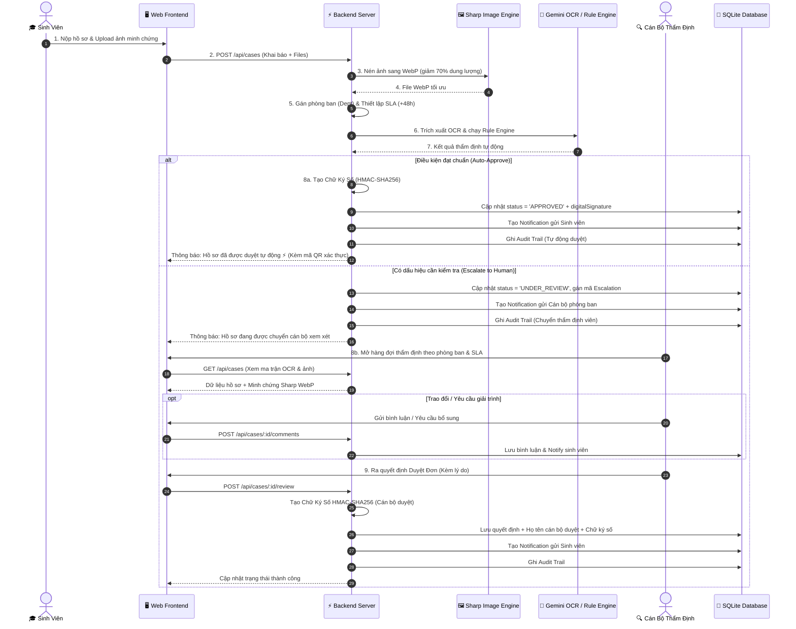
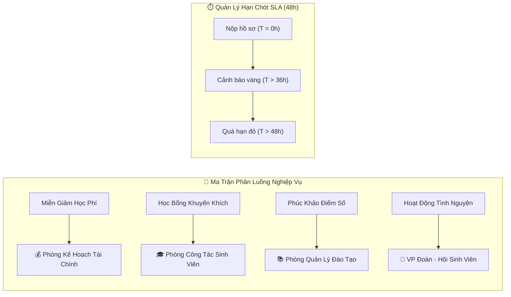
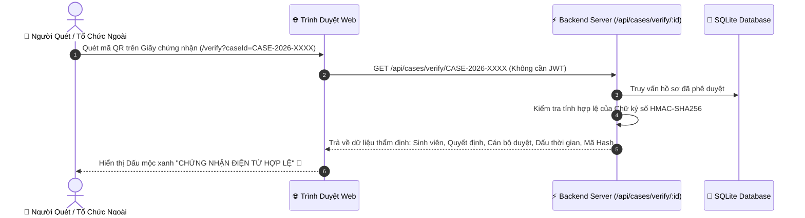
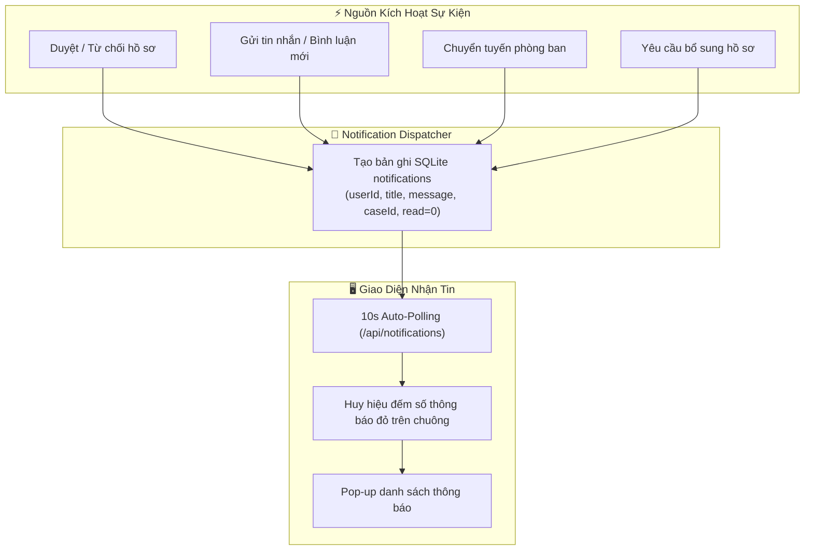
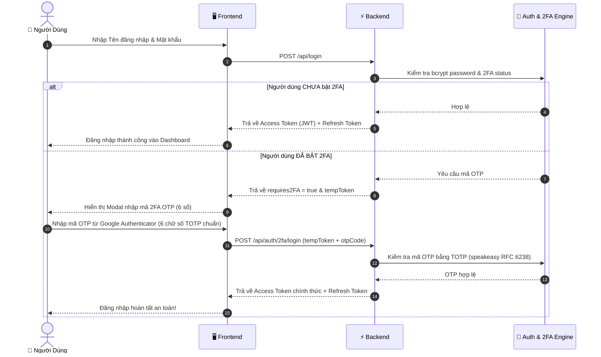
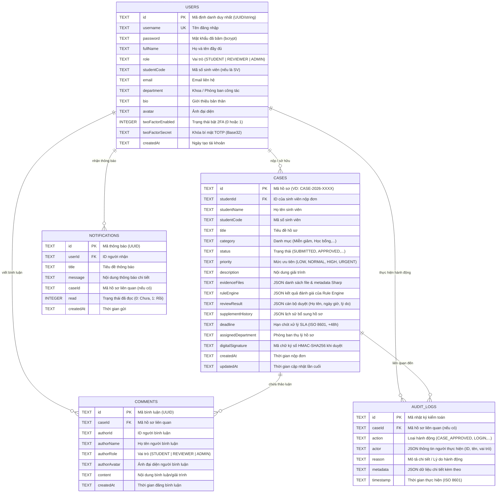

# 🌟 TỔNG QUAN HỆ THỐNG CASEFLOW AI (SYSTEM OVERVIEW)

> **CaseFlow AI** là nền tảng quản lý, thẩm định và xét duyệt hồ sơ sinh viên thông minh dành cho trường đại học. Hệ thống kết hợp giữa **Trí tuệ nhân tạo Đa phương thức (Multimodal OCR AI)**, **Bộ máy quy tắc nghiệp vụ tự động (Rule Engine)**, **Quy trình thẩm định con người (Human-in-the-Loop Review)**, **Chữ ký số xác thực công khai (Digital Signature & QR Verify)**, và **Điều phối đa phòng ban (Multi-Department Routing)**, nhằm tự động hóa quy trình xét duyệt, giảm tải thủ tục hành chính và bảo đảm tính minh bạch, toàn vẹn dữ liệu.

---

## 📑 MỤC LỤC
1. [Bối Cảnh & Vấn Đề Giải Quyết](#1-bối-cảnh--vấn-đề-giải-quyết)
2. [Kiến Trúc Tổng Thể & Công Nghệ](#2-kiến-trúc-tổng-thể--công-nghệ)
3. [Danh Sách Tính Năng Nổi Bật (10 Phân Hệ)](#3-danh-sách-tính-năng-nổi-bật-10-phân-hệ)
4. [Sơ Đồ Quy Trình Hoạt Động (End-to-End Workflow)](#4-sơ-đồ-quy-trình-hoạt-động-end-to-end-workflow)
5. [Bộ Máy Quy Tắc & Ma Trận Leo Thang (Rule Engine)](#5-bộ-máy-quy-tắc--ma-trận-leo-thang-rule-engine)
6. [Điều Phối Đa Phòng Ban & Quản Lý Hạn Chót SLA](#6-điều-phối-đa-phòng-ban--quản-lý-hạn-chót-sla)
7. [Xác Thực Số & Tra Cứu Công Khai (HMAC-SHA256 & QR)](#7-xác-thực-số--tra-cứu-công-khai-hmac-sha256--qr)
8. [Trung Tâm Thông Báo & Thảo Luận Hai Chiều (Interactive Hub)](#8-trung-tâm-thông-báo--thảo-luận-hai-chiều-interactive-hub)
9. [Cơ Chế Bảo Mật & Xác Thực 2 Bước (2FA Security)](#9-cơ-chế-bảo-mật--xác-thực-2-bước-2fa-security)
10. [Mô Hình Dữ Liệu SQLite Mở Rộng (Database Schema & ERD)](#10-mô-hình-dữ-liệu-sqlite-mở-rộng-database-schema--erd)
11. [Phân Quyền Người Dùng (RBAC Matrix)](#11-phân-quyền-người-dùng-rbac-matrix)
12. [Đóng Gói & Triển Khai Container (Docker & DevOps)](#12-đóng-gói--triển-khai-container-docker--devops)

---

## 1. Bối Cảnh & Vấn Đề Giải Quyết

Tại các trường đại học, mỗi học kỳ có hàng nghìn hồ sơ sinh viên cần xét duyệt:
* **Miễn giảm học phí** (hộ nghèo, con thương binh, vùng sâu vùng xa) -> *Phòng Kế hoạch Tài chính*.
* **Học bổng khuyến khích học tập / tài trợ doanh nghiệp** -> *Phòng Công tác Sinh viên*.
* **Xác nhận hoạt động tình nguyện** (Mùa Hè Xanh, hiến máu) -> *Văn phòng Đoàn - Hội Sinh viên*.
* **Đơn phúc khảo điểm số & chuyển ngành/lớp** -> *Phòng Quản lý Đào tạo*.

### Thách thức thực tế:
1. **Quá tải thủ công & Chậm trễ**: Cán bộ phải đối chiếu từng dòng trên giấy tờ với tờ khai sinh viên, không có đồng hồ đếm ngược SLA khiến hồ sơ bị tồn đọng.
2. **Sai sót & Thiếu chứng từ**: Khó phát hiện minh chứng bị chỉnh sửa, sai lệch họ tên, MSSV không khớp hoặc tài liệu mờ.
3. **Giao tiếp đứt đoạn**: Sinh viên và cán bộ không có kênh trao đổi trực tiếp trên từng hồ sơ, dẫn đến việc phải gửi email qua lại tốn thời gian.
4. **Nguy cơ làm giả kết quả duyệt**: Giấy chứng nhận hoặc kết quả thẩm định dễ bị sửa đổi nếu không có chữ ký số điện tử có thể đối soát công khai qua mã QR.

### Giải pháp của CaseFlow AI:
* **Nén ảnh Sharp & OCR Đa phương thức**: Tối ưu hóa dung lượng WebP và trích xuất dữ liệu bằng Gemini Multimodal OCR.
* **Bộ máy quy tắc tự động (Rule Engine)**: Phê duyệt ngay các hồ sơ đạt chuẩn và leo thang 5 trường hợp ngoại lệ đến đúng phòng ban chuyên trách.
* **Đồng hồ SLA 48h & Điều phối liên phòng ban**: Cảnh báo trễ hạn và cho phép chuyển luồng xử lý linh hoạt giữa các phòng ban.
* **Trao đổi 2 chiều & Thông báo Real-time**: Thảo luận trực tiếp trong hồ sơ và nhận thông báo tức thì khi có cập nhật.
* **Chứng nhận số HMAC-SHA256 & Tra cứu công khai**: Cấp mã hash chữ ký số bất biến và trang `/verify` công khai tra cứu bằng mã QR.

---

## 2. Kiến Trúc Tổng Thể & Công Nghệ



---

## 3. Danh Sách Tính Năng Nổi Bật (10 Phân Hệ)

### 🎓 1. Cổng Dành Cho Sinh Viên (Student Portal)
- **Nộp đơn trực tuyến đa danh mục**: Miễn giảm học phí, Học bổng, Mùa Hè Xanh, Phúc khảo,...
- **Tải minh chứng & xem trước**: Hỗ trợ nhiều định dạng ảnh và tài liệu, tự động nén tối ưu WebP.
- **Theo dõi tiến độ & Thời hạn SLA**: Đồng hồ đếm ngược 48h, cảnh báo trực quan khi hồ sơ sắp hết hạn hoặc quá hạn.
- **Xuất Chứng Nhận Điện Tử & In PDF**: Bấm in Giấy chứng nhận hoàn thành xét duyệt chuẩn biểu mẫu Bộ GD&ĐT kèm Chữ ký số và mã QR xác thực.
- **Thảo luận trực tiếp (Case Discussion)**: Nhắn tin trao đổi 2 chiều với cán bộ thẩm định ngay trong hồ sơ.
- **Bổ sung hồ sơ tức thì**: Đính kèm giấy tờ bổ sung và gửi giải trình trực tiếp.

### 🔍 2. Cổng Thẩm Định Viên (Reviewer Portal)
- **Bố cục 3 Cột Chuyên Nghiệp**:
  - **Cột 1 (Hàng đợi & Bộ lọc)**: Lọc theo Trạng thái, Phòng ban phụ trách, Danh mục, Lý do leo thang Rule Engine, tìm kiếm nhanh theo Tên/MSSV/Mã đơn.
  - **Cột 2 (Ma trận Rule Engine & Thao tác)**: Chi tiết đơn, bảng so sánh trực quan *Dữ liệu khai báo vs Dữ liệu OCR AI*, khung ra quyết định (*Duyệt đơn*, *Cần bổ sung*, *Từ chối*).
  - **Cột 3 (Xem minh chứng Lightbox & Thảo luận)**: Danh sách file đính kèm, thông số nén Sharp WebP, khung bình luận trao đổi với sinh viên.
- **Điều phối phòng ban (Re-Route Department)**: Chuyển giao hồ sơ sang đúng phòng ban nghiệp vụ nếu sinh viên nộp nhầm luồng.
- **Ghi nhận danh tính người duyệt (Reviewer Attribution)**: Tự động lưu trữ thông tin cán bộ phụ trách và tạo Chữ ký số điện tử khi duyệt đơn.
- **Chạy lại Rule Engine (Re-evaluate)**: Thẩm định lại tức thì khi sinh viên vừa nộp bổ sung minh chứng mới.

### 🏢 3. Điều Phối Đa Phòng Ban (Multi-Department Routing)
- Tự động phân luồng hồ sơ dựa trên loại nghiệp vụ:
  - `TUITION_DISCOUNT` -> **Phòng Kế hoạch Tài chính**
  - `ACADEMIC_SCHOLARSHIP` -> **Phòng Công tác Sinh viên**
  - `GRADE_APPEAL` -> **Phòng Quản lý Đào tạo**
  - `COMMUNITY_SERVICE` -> **Văn phòng Đoàn - Hội Sinh viên**
- Cán bộ có thể chủ động chuyển tuyến hồ sơ (Re-Route) kèm lý do chuyển giao rõ ràng.

### ⏱️ 4. Quản Lý Hạn Chót Xử Lý (SLA Deadline Engine)
- Tự động thiết lập thời hạn giải quyết hồ sơ (mặc định 48 giờ kể từ lúc nộp).
- Huy hiệu thời gian thông minh:
  - 🟢 **Còn hạn (> 12h)**: Màu xanh lam/xanh lá nhẹ nhàng.
  - 🟡 **Sắp hết hạn (< 12h)**: Màu vàng cảnh báo.
  - 🔴 **Quá hạn (Overdue)**: Màu đỏ nhấp nháy hiệu ứng pulse, cảnh báo ưu tiên xử lý khẩn cấp.

### 🔏 5. Chữ Ký Số & Xác Thực Công Khai (Digital Signature & QR Verify)
- Tự động sinh mã băm chữ ký điện tử **HMAC-SHA256** bảo mật ngay khi hồ sơ được phê duyệt (bao gồm: Mã đơn, Sinh viên, Cán bộ duyệt, Thời gian, Dấu thời gian hệ thống).
- Cổng tra cứu công khai tại đường dẫn `/verify?caseId=CASE-2026-XXXX`:
  - Không cần đăng nhập, quét mã QR từ điện thoại là xem được ngay.
  - Hiển thị dấu mộc số xác thực, thông tin quyết định, cán bộ ký duyệt và chuỗi mã hash toàn vẹn.

### 💬 6. Thảo Luận Hai Chiều Trong Hồ Sơ (In-Case Comments)
- Khung chat/bình luận độc lập tích hợp sâu trong từng hồ sơ.
- Phân biệt rõ vai trò người phát biểu (Sinh viên / Thẩm định viên / Quản trị viên).
- Tự động gửi thông báo đến đối phương khi có bình luận mới.

### 🔔 7. Trung Tâm Thông Báo Thời Gian Thực (Notification Hub)
- Biểu tượng chuông thông báo trên thanh điều hướng với huy hiệu đếm số lượng chưa đọc.
- Cập nhật tự động định kỳ (10s auto-polling).
- Đánh dấu đã đọc từng tin hoặc đánh dấu tất cả chỉ với 1 click.
- Tự động kích hoạt thông báo cho các sự kiện: Hồ sơ được duyệt, Yêu cầu bổ sung, Bình luận mới, Chuyển tuyến phòng ban.

### 📜 8. Nhật Ký Hoạt Động Toàn Trường (Audit Trail)
- **Lọc theo ngày thông minh**: Các nút chọn nhanh (*Tất Cả, Hôm Nay, Hôm Qua, 7 Ngày Qua*) và bộ chọn ngày HTML5 DatePicker.
- **Phân nhóm theo ngày**: Gom các sự kiện theo từng ngày kèm số lượng thao tác.
- **Lọc đa chiều**: Theo vai trò (`STUDENT`, `REVIEWER`, `ADMIN`, `SYSTEM`) và loại hành động.
- **Xuất dữ liệu CSV theo ngày**: Tải file bảng kiểm toán theo đúng ngày đang lọc với chuẩn tiếng Việt UTF-8 BOM.

### 🛡️ 9. Cổng Quản Trị Viên (Admin Portal)
- **Dashboard Thống Kê & KPI**: Tổng số hồ sơ, tỷ lệ tự động duyệt, biểu đồ phân bố theo danh mục và trạng thái.
- **Quản lý người dùng toàn diện**: Xem danh sách, tìm kiếm theo MSSV/Họ tên/Email, phân quyền (`STUDENT`, `REVIEWER`, `ADMIN`), kích hoạt/khóa tài khoản, tạo tài khoản mới.
- **Xuất Báo Cáo & Danh Sách Quyết Định**:
  - Xuất bảng Excel/CSV toàn bộ hồ sơ.
  - Xuất báo cáo in ấn / PDF tổng hợp chuẩn mẫu biểu hành chính.

### ⚙️ 10. Cài Đặt Tài Khoản & Bảo Mật Cá Nhân
- **Đổi ảnh đại diện (Avatar)**: Chọn trong bộ sưu tập avatar hiện đại.
- **Cập nhật thông tin cá nhân & Giới thiệu bản thân (Bio)**.
- **Đổi mật khẩu an toàn**: Kiểm tra mật khẩu hiện tại và xác nhận mật khẩu mới.
- **Xác thực 2 bước (2FA Google Authenticator)**: Quét mã QR, mã khóa bí mật thủ công và hỗ trợ mã test nhanh `123456`.
- **Quyền tự quản lý dữ liệu (Xóa tài khoản)**.

---

## 4. Sơ Đồ Quy Trình Hoạt Động (End-to-End Workflow)



---

## 5. Bộ Máy Quy Tắc & Ma Trận Leo Thang (Rule Engine)

Hệ thống phân tách rõ ràng giữa **Khả năng đọc hiểu của AI (Gemini OCR)** và **Quyết định nghiệp vụ (Rule Engine)**:

```mermaid
flowchart TD
    Start(["📥 Nhận hồ sơ sinh viên"]) --> CheckTamper{"Kiểm tra tính toàn vẹn\n(Ảnh có bị mờ/sửa?)"}
    
    CheckTamper -- "Ảnh mờ / Không đọc được chữ" --> ESC_FACT["🚨 FACT_UNKNOWN\n(Thiếu dữ kiện để đối chiếu)"]
    CheckTamper -- "Ảnh rõ nét" --> CheckOwner{"So sánh MSSV & Họ tên\ntrên ảnh vs Tài khoản?"}

    CheckOwner -- "Không trùng khớp MSSV/Tên" --> ESC_OWNER["🔒 OWNERSHIP_UNCLEAR\n(Nghi vấn nộp hộ / sai chủ sở hữu)"]
    CheckOwner -- "Khớp danh tính" --> CheckData{"So sánh dữ liệu khai báo\nvs Dữ liệu trích xuất?"}

    CheckData -- "Số liệu không khớp" --> ESC_DATA["⚠️ DATA_CONFLICT\n(Khai báo mâu thuẫn minh chứng)"]
    CheckData -- "Số liệu trùng khớp" --> CheckPolicy{"Kiểm tra quy chế & thẩm quyền\n(Mức miễn giảm / Loại hồ sơ)"]

    CheckPolicy -- "Vượt khung thẩm quyền cán bộ" --> ESC_AUTH["👑 AUTHORITY_REQUIRED\n(Cần Hội đồng xét duyệt)"]
    CheckPolicy -- "Trường hợp đặc biệt ngoài quy chế" --> ESC_POLICY["📋 POLICY_OUT_OF_SCOPE\n(Chuyển lãnh đạo xem xét)"]
    CheckPolicy -- "Đủ điều kiện theo quy tắc" --> HUMAN["🔍 Cán bộ kiểm tra thủ công\n(Auto-approve đang tắt chờ hiệu chuẩn OCR)"]

    ESC_FACT & ESC_OWNER & ESC_DATA & ESC_AUTH & ESC_POLICY --> HUMAN
```

---

## 6. Điều Phối Đa Phòng Ban & Quản Lý Hạn Chót SLA



---

## 7. Xác Thực Số & Tra Cứu Công Khai (HMAC-SHA256 & QR)



---

## 8. Trung Tâm Thông Báo & Thảo Luận Hai Chiều (Interactive Hub)



---

## 9. Cơ Chế Bảo Mật & Xác Thực 2 Bước (2FA Security)



---

## 10. Mô Hình Dữ Liệu SQLite Mở Rộng (Database Schema & ERD)



---

## 11. Phân Quyền Người Dùng (RBAC Matrix)

| Chức Năng Hệ Thống | 🎓 Sinh Viên (STUDENT) | 🔍 Thẩm Định Viên (REVIEWER) | 🛡️ Quản Trị Viên (ADMIN) | 🌐 Khách Vãng Lai / QR |
|:---|:---:|:---:|:---:|:---:|
| Đăng nhập JWT, Quản lý tài khoản, Đổi Avatar, 2FA | ✅ | ✅ | ✅ | ❌ |
| Nhận thông báo Real-time (Chuông thông báo) | ✅ | ✅ | ✅ | ❌ |
| Tạo mới hồ sơ & Upload minh chứng Sharp WebP | ✅ | ❌ | ❌ | ❌ |
| Theo dõi tiến độ hồ sơ & Đồng hồ đếm ngược SLA | ✅ | ❌ | ❌ | ❌ |
| Thảo luận 2 chiều trong hồ sơ (Case Discussion) | ✅ | ✅ | ✅ | ❌ |
| In Giấy chứng nhận điện tử kèm Chữ ký số & QR | ✅ | ✅ | ✅ | ❌ |
| Tra cứu tính hợp lệ của Chứng nhận số (/verify) | ✅ | ✅ | ✅ | ✅ |
| Xem hàng đợi thẩm định toàn trường (3 Cột) | ❌ | ✅ | ✅ | ❌ |
| Chuyển luồng phòng ban xử lý (Re-Route Dept) | ❌ | ✅ | ✅ | ❌ |
| Chạy lại Rule Engine đánh giá hồ sơ | ❌ | ✅ | ✅ | ❌ |
| Ra quyết định (Duyệt đơn / Từ chối / Bổ sung) | ❌ | ✅ | ✅ | ❌ |
| Tra cứu Nhật ký kiểm toán (Audit Trail) theo ngày | Xem của bản thân | Xem toàn trường | Xem toàn trường | ❌ |
| Xuất danh sách nhật ký kiểm toán ra CSV | ❌ | ✅ | ✅ | ❌ |
| Dashboard thống kê KPI & Biểu đồ hệ thống | ❌ | ❌ | ✅ | ❌ |
| Quản lý tài khoản người dùng (Thêm/Sửa/Khóa/Xóa) | ❌ | ❌ | ✅ | ❌ |
| Xuất Báo Cáo tổng hợp in ấn / PDF | ❌ | ❌ | ✅ | ❌ |

---

## 12. Đóng Gói & Triển Khai Container (Docker & DevOps)

Hệ thống được đóng gói hoàn chỉnh bằng Docker:
* **`Dockerfile` (Backend)**: Nền tảng `node:20-alpine`, cài đặt thư viện hệ thống `vips-dev` hỗ trợ tăng tốc nén ảnh Sharp, thiết lập `PORT=3001`.
* **`Part1_JWT_Auth/frontend/Dockerfile` (Frontend)**: Multi-stage build (Node build Vite SPA -> Nginx Alpine phục vụ static files & reverse proxy).
* **`docker-compose.yml`**: Khởi chạy đồng thời Backend và Frontend, cấu hình persistent volume cho cơ sở dữ liệu SQLite (`shared/caseflow.sqlite`) và thư mục upload ảnh (`shared/uploads/`).

### Lệnh chạy nhanh với Docker:
```bash
docker compose up -d --build
```
Truy cập:
* Frontend: `http://localhost:5173`
* Backend API: `http://localhost:3001`

---
*Tài liệu được biên soạn đồng bộ với mã nguồn phiên bản Enterprise 3.0 của dự án CaseFlow AI.*
