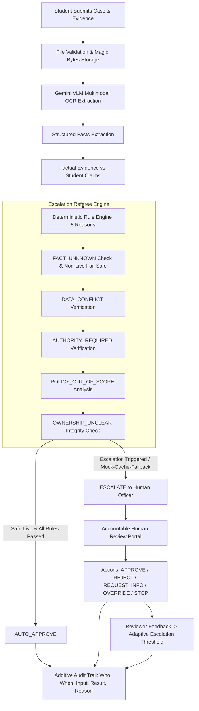

# EDUASSISTANT - SYSTEM ARCHITECTURE
Track VNG – Option A: The Escalation Referee (MLAI Hackathon 2026)

## 1. High-Level Architecture Overview
EDUASSISTANT is not a conversational chatbot; it is an **Autonomous Workflow & Multimodal Decision Coordinator** with strict Human-in-the-Loop safeguards and an Escalation Referee engine.

## 2. Core Architectural Principles
1. **Gemini does NOT decide policy:** LLM/VLM is solely an extraction and communication assistant. Factual evidence extracted from genuine OCR takes strict precedence over generated text.
2. **Safe Fallback & Non-Live Fail-Safe:** If `AI_MODE` is mock, cache, fallback, or synthetic, the system categorically denies `AUTO_APPROVE` and escalates to `ESCALATE_TO_HUMAN` (`FACT_UNKNOWN`, `UNDER_REVIEW`).
3. **Single Source of Truth for AI Mode:** `ai_service.get_ai_mode()` is the global runtime truth controlling case analysis, evidence OCR, and provenance metadata simultaneously.
4. **Adaptive Escalation Threshold:** A dynamic threshold clamped in `[0.65, 0.90]` adjusts deterministically (+0.02 upon `MISSED_ESCALATION`, -0.02 upon `UNNECESSARY_ESCALATION`) based on human reviewer feedback.
5. **Workflow Transition Guard:** Status progressions follow deterministic state transitions (`SUBMITTED -> UNDER_REVIEW -> APPROVED / REJECTED / REQUIRES_SUPPLEMENT / STOPPED`). Terminal states cannot be reverted without explicit administrative override.
6. **Immutable Audit Accountability:** Every state transition and decision persists Who, When, Case, Input Data, Result, and Reason to both Microsoft SQL Server and SQLite fallback.
7. **Deterministic Verify Harness:** Endpoints (`POST /api/verify/run`) and executable benchmarks (`benchmark/run_benchmark.py`) provide judges and evaluators with reproducible, in-memory validation without mutating production databases.
