# đŸ›ï¸ CẤU TRÚC VĂ€ KIẾN TRÚC MĂƒ NGUá»’N FRONTEND - CASEFLOW AI

TĂ i liệu nĂ y mĂ´ tả chi tiết sÆ¡ đồ tổ chức thÆ° mục, chức năng của từng module/component vĂ  luồng dữ liệu trong giao diện người dĂ¹ng **CaseFlow AI (React + Vite)**.

---

## 1. đŸ“ SÆ  ĐỒ CĂ‚Y THƯ MỤC (DIRECTORY TREE)

```
frontend/
├── public/
│   ├── _redirects                     # Cấu hình định tuyến SPA cho Cloudflare / Render
│   ├── favicon.svg                    # Biểu tượng website
│   └── icons.svg                      # Sprite biểu tượng SVG
├── src/
│   ├── api/
│   │   └── client.js                  # Axios client, cấu hình API_BASE, SERVER_BASE & Interceptor
│   ├── context/
│   │   └── AuthContext.jsx            # State quản trị xĂ¡c thá»±c, Token, Refresh Token, 2FA TOTP
│   ├── utils/
│   │   └── formatters.jsx             # HĂ m định dạng ngĂ y giờ vi-VN & Badge tĂ­nh toĂ¡n SLA 48h
│   ├── components/
│   │   ├── common/
│   │   │   ├── ProtectedRoute.jsx     # Bộ bảo vệ tuyến đường (Private Route Guard)
│   │   │   └── AppHeader.jsx          # Thanh Ä‘iều hÆ°á»›ng trĂªn cĂ¹ng, đổi Role Tab & AI Mode
│   │   ├── notifications/
│   │   │   └── NotificationBell.jsx   # ChuĂ´ng & Popover thĂ´ng bĂ¡o đẩy thời gian thá»±c (Polling 10s)
│   │   ├── discussion/
│   │   │   └── CaseDiscussion.jsx     # KĂªnh trao đổi, bình luận trá»±c tiếp trĂªn hồ sÆ¡ sinh viĂªn
│   │   ├── audit/
│   │   │   └── AuditTrailViewer.jsx   # Bảng nhật kĂ½ kiểm toĂ¡n bất biến, bá»™ lọc & xuất CSV
│   │   └── modals/
│   │       └── TwoFactorModal.jsx     # Popup kĂ­ch hoạt / vĂ´ hiệu hĂ³a bảo mật 2FA (QR Code OTP)
│   ├── pages/
│   │   ├── auth/
│   │   │   └── AuthPage.jsx           # MĂ n hình Đăng nhập, Đăng kĂ½ sinh viĂªn, OTP Challenge
│   │   ├── student/
│   │   │   └── StudentPortal.jsx      # Cổng nộp hồ sơ AI OCR, xem tiến độ & quyết định
│   │   ├── reviewer/
│   │   │   └── ReviewerPortal.jsx     # Cổng cĂ¡n bá»™: Thẩm định hồ sÆ¡, kĂ½ số HMAC, xuất PDF/CSV
│   │   ├── admin/
│   │   │   └── AdminPortal.jsx        # Cổng quản trị: Quản lĂ½ người dĂ¹ng, phĂ¢n quyền, AI Toggle
│   │   ├── settings/
│   │   └── AccountSettingsPortal.jsx # Trang cĂ¡ nhĂ¢n: Đổi mật khẩu, avatar WebP, cĂ i đặt 2FA
│   │   └── public/
│   │       └── PublicVerificationPage.jsx # Cổng tra cứu xĂ¡c thá»±c chữ kĂ½ số cĂ´ng khai qua mĂ£ QR
│   ├── assets/                        # Hình ảnh logo, banner minh họa
│   ├── App.css                        # Style tĂ¹y biến bổ sung
│   ├── index.css                      # Hệ thống Design System mĂ u tối (Cyber Dark UI)
│   ├── App.jsx                        # Root Component & Bộ định tuyến React Router
│   └── main.jsx                       # Điểm khởi động ứng dụng React (React DOM Entry)
├── Dockerfile                         # Khởi tạo container Nginx Ä‘Ă³ng gĂ³i Frontend
├── package.json                       # Khai bĂ¡o dependencies (React, Vite, Lucide-React, Axios)
├── vite.config.js                     # Cấu hình mĂ¡y chủ phĂ¡t triển Vite & proxy
└── cautruc.md                         # TĂ i liệu kiến trĂºc Frontend (tệp nĂ y)
```

---

## 2. đŸ§© CHI TIẾT CÁC PHĂ‚N HỆ VĂ€ TỪNG FILE

### 2.1. Tầng Kết Nối API & Trạng ThĂ¡i ToĂ n Cục (API & Context)
- **`src/api/client.js`**:
  - Tá»± Ä‘á»™ng nhận diện biến mĂ´i trường `VITE_API_BASE_URL` hoặc fallback về `http://localhost:3001/api`.
  - Thiết lập Axios Interceptor tự động gắn Header `Authorization: Bearer <Token>`.
- **`src/context/AuthContext.jsx`**:
  - Quản lĂ½ phiĂªn lĂ m việc của người dĂ¹ng (`user`, `token`, `refreshToken`).
  - Há»— trợ cÆ¡ chế tá»± Ä‘á»™ng xoay vĂ²ng Token (`tryRefreshToken`) khi Access Token hết hạn.
  - Cung cấp cĂ¡c hĂ m xĂ¡c thá»±c: `login`, `login2FA`, `registerStudent`, `updateProfile`, `changePassword`, `generate2FA`, `enable2FA`, `disable2FA`, `logout`.

---

### 2.2. Tầng ThĂ nh Phần DĂ¹ng Chung (Common Components)
- **`src/components/common/ProtectedRoute.jsx`**:
  - Chặn người dĂ¹ng chÆ°a đăng nhập truy cập vĂ o cĂ¡c trang ná»™i bá»™, tá»± Ä‘á»™ng Ä‘iều hÆ°á»›ng về `/login`.
- **`src/components/common/AppHeader.jsx`**:
  - Hiển thị thĂ´ng tin người dĂ¹ng, ảnh đại diện avatar WebP, huy hiệu vai trĂ² (`STUDENT`, `REVIEWER`, `ADMIN`).
  - Cho phĂ©p quản trị viĂªn chuyển đổi chế Ä‘á»™ AI (`Live Gemini`, `Mock`, `Cache`) trá»±c tiếp trĂªn thanh Ä‘iều hÆ°á»›ng.
- **`src/components/notifications/NotificationBell.jsx`**:
  - ChuĂ´ng thĂ´ng bĂ¡o vá»›i bá»™ đếm tin chÆ°a đọc.
  - Tá»± Ä‘á»™ng thăm dĂ² (polling) má»—i 10 giĂ¢y để nhận thĂ´ng bĂ¡o má»›i khi hồ sÆ¡ thay đổi trạng thĂ¡i hoặc cĂ³ bình luận.
- **`src/components/discussion/CaseDiscussion.jsx`**:
  - Cho phĂ©p sinh viĂªn vĂ  cĂ¡n bá»™ nhắn tin, trao đổi trá»±c tiếp trĂªn từng hồ sÆ¡ để giải trình minh chứng.
- **`src/components/audit/AuditTrailViewer.jsx`**:
  - Nhật kĂ½ kiểm toĂ¡n Ä‘a chiều: Lọc theo hĂ nh Ä‘á»™ng (`CREATE`, `APPROVE`, `REJECT`, `2FA_ENABLE`,...), mĂ£ hồ sÆ¡, vai trĂ² vĂ  ngĂ y thĂ¡ng.
  - Hỗ trợ xuất dữ liệu ra file CSV chuẩn UTF-8 BOM.
- **`src/components/modals/TwoFactorModal.jsx`**:
  - Hiển thị mĂ£ QR TOTP để quĂ©t bằng Google Authenticator / Authy.
  - XĂ¡c nhận mĂ£ 6 số thời gian thá»±c vĂ  kĂ­ch hoạt bảo mật tĂ i khoản.

---

### 2.3. Tầng Giao Diện Nghiệp Vụ Theo Vai TrĂ² (Role Portals)
- **`src/pages/auth/AuthPage.jsx`**:
  - Đăng nhập bảo mật Ä‘a lá»›p (há»— trợ thá»­ thĂ¡ch 2FA nếu tĂ i khoản Ä‘Ă£ bật).
  - Đăng kĂ½ tĂ i khoản sinh viĂªn má»›i kèm phĂ¢n bổ mĂ£ sinh viĂªn (MSSV) vĂ  khoa trá»±c thuá»™c.
- **`src/pages/student/StudentPortal.jsx`**:
  - Biểu mẫu ná»™p hồ sÆ¡ học vụ thĂ´ng minh kèm kiểm tra định dạng minh chứng (PNG, JPG, WebP, PDF).
  - TrĂ­ch xuất thĂ´ng tin OCR vĂ  gợi Ă½ kết quả tá»± Ä‘á»™ng bằng AI.
  - Theo dõi danh sĂ¡ch Ä‘Æ¡n cĂ¡ nhĂ¢n, đếm ngược thời hạn giải quyết SLA 48h.
- **`src/pages/reviewer/ReviewerPortal.jsx`**:
  - HĂ ng đợi thẩm định hồ sÆ¡: xem trÆ°á»›c minh chứng, kết quả trĂ­ch xuất AI, giải trình luật leo thang.
  - PhĂª duyệt / Từ chối / YĂªu cầu bổ sung hồ sÆ¡ kèm **KĂ½ số Ä‘iện tá»­ HMAC-SHA256**.
  - Xuất bảng in PDF quyết định học vụ vĂ  xuất danh sĂ¡ch Ä‘Æ¡n ra CSV.
- **`src/pages/admin/AdminPortal.jsx`**:
  - Quản lĂ½ danh sĂ¡ch người dĂ¹ng toĂ n hệ thống, cập nhật vai trĂ², mở khĂ³a mật khẩu.
  - Theo dõi chỉ số hệ thống (System Metrics), dung lượng lÆ°u trữ minh chứng.
- **`src/pages/settings/AccountSettingsPortal.jsx`**:
  - Cập nhật thĂ´ng tin cĂ¡ nhĂ¢n, tải ảnh đại diện cắt vuĂ´ng tối Æ°u WebP, đổi mật khẩu vĂ  quản lĂ½ bảo mật 2FA.
- **`src/pages/public/PublicVerificationPage.jsx`**:
  - Trang xĂ¡c minh cĂ´ng khai dĂ nh cho cÆ¡ quan bĂªn ngoĂ i hoặc sinh viĂªn quĂ©t mĂ£ QR trĂªn giấy chứng nhận để kiểm tra tĂ­nh toĂ n vẹn của chữ kĂ½ số HMAC.

---

## 3. đŸ”„ LUá»’NG Dá»® LIỆU CHÍNH (DATA FLOW)



---

## 4. đŸš€ HƯỚNG DẪN KHỞI CHẠY PHÁT TRIỂN (DEVELOPMENT)

```bash
# 1. Di chuyển vĂ o thÆ° mục frontend
cd frontend

# 2. CĂ i đặt thÆ° viện phụ thuá»™c
npm install

# 3. Chạy mĂ¡y chủ phĂ¡t triển Vite
npm run dev

# 4. BiĂªn dịch bản Ä‘Ă³ng gĂ³i Production
npm run build
```