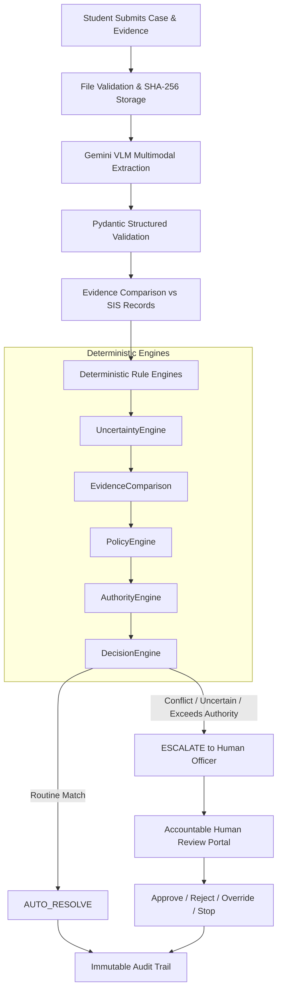

# CASEFLOW AI - SYSTEM ARCHITECTURE
Challenge A: The Escalation Referee (MLAI Hackathon 2026)

## 1. High-Level Architecture Overview
CaseFlow AI is not a conversational chatbot; it is a **Deterministic Workflow and Multimodal Decision Coordinator** with human-in-the-loop safeguards.

## 2. Core Principles
1. **Gemini does NOT make autonomous policy decisions:** LLM/VLM is solely an extraction and communication assistant.
2. **Safe Fallback & Zero Hallucination:** Incomplete or blurred fields trigger `FACT_UNKNOWN`.
3. **Accountability:** Every state transition records Who, What, When, Input, Evidence, Why, Policy, and Result.
